# makenames
**不同国家姓氏文本生成（Pytorch完成）**
1. 网络结构：
自定义RNN网络结构、GRU、LSTM等不同网络的尝试
2. 优化方法：
不同优化方法，Adam、AdamW等优化方法的尝试，尽量对比不同优化方法的结果
3. 比较不同batch_size的训练结果及效率

**数据集**

使用18个国家姓氏的文本txt,在此基础上自行扩充数据集内容，尽量每个国家包含50个以上不同姓氏

## 数据处理

### 数据预处理

从[这里](https://download.pytorch.org/tutorial/data.zip)下载数据，并将其提取到当前目录。

在data/names目录中包括了18个名为[Language].txt的文本文件。每个文件包含很多名字，每行一个名字，大部分是罗马化的（但仍然需要从Unicode转换为ASCII）。

最终会得到一个每个语言的名字列表的字典，{language: [names...]}。

```python
from __future__ import unicode_literals, print_function, division
from io import open
import glob
import os

def findFiles(path): return glob.glob(path)

print(findFiles('data/names/*.txt'))

import unicodedata
import string

all_letters = string.ascii_letters + " .,;'"
n_letters = len(all_letters)

# Turn a Unicode string to plain ASCII, thanks to https://stackoverflow.com/a/518232/2809427
def unicodeToAscii(s):
    return ''.join(
        c for c in unicodedata.normalize('NFD', s)
        if unicodedata.category(c) != 'Mn'
        and c in all_letters
    )

print(unicodeToAscii('Ślusàrski'))

# Build the category_lines dictionary, a list of names per language
category_lines = {}
all_categories = []

# Read a file and split into lines
def readLines(filename):
    lines = open(filename, encoding='utf-8').read().strip().split('\n')
    return [unicodeToAscii(line) for line in lines]

for filename in findFiles('data/names/*.txt'):
    category = os.path.splitext(os.path.basename(filename))[0]
    all_categories.append(category)
    lines = readLines(filename)
    category_lines[category] = lines

n_categories = len(all_categories)
```

### 构建dataloader

`NameDataset`类用于加载数据集，`build_dataloader`函数用于构建训练集和测试集的DataLoader对象。

在NameDataset类中，首先获取所有数据文件的文件名，然后将每个文件名中的类别作为一个类别标签，将文件中的每一行作为一个样本，将类别标签和数据组成一个元组并添加到`lines`列表中。

通过传入的idx参数获取对应的数据和标签，将输入数据转换成Tensor对象，将标签转换成LongTensor对象，并返回一个元组。

最后用`torch.utils.data.DataLoader`直接划分训练集和测试集的DataLoader对象。

```python
import torch
from data import *
import random


def collate(batch):
    inputs = [item[0] for item in batch]
    targets = [item[1] for item in batch]
    inputs = torch.nn.utils.rnn.pad_sequence(inputs, batch_first=True)
    targets = torch.stack(targets)
    return inputs, targets


class NameDataset(torch.utils.data.Dataset):
    def __init__(self, root_dir, is_train=True):
        self.categories = []
        self.lines = []
        self.n_categories = 0

        for filename in findFiles(root_dir + '/*.txt'):
            category = filename.split('/')[-1].split('.')[0]
            self.categories.append(category)
            lines = readLines(filename)

            if is_train:
                lines = lines[:int(0.8 * len(lines))]
            else:
                lines = lines[int(0.8 * len(lines)):]

            self.lines += [(line, self.n_categories) for line in lines]
            self.n_categories += 1

    def __len__(self):
        return len(self.lines)

    def __getitem__(self, idx):
        line, category_idx = self.lines[idx]
        category = torch.tensor(category_idx, dtype=torch.long)
        line_tensor = lineToTensor(line)
        return line_tensor, category


def build_dataloader(batch_size):
    train_dataset = NameDataset('data/names/', is_train=True)
    train_loader = torch.utils.data.DataLoader(train_dataset, batch_size=batch_size, shuffle=True, collate_fn=collate)
    test_dataset = NameDataset('data/names/', is_train=False)
    test_loader = torch.utils.data.DataLoader(test_dataset, batch_size=batch_size, shuffle=False, collate_fn=collate)
    return train_loader, test_loader, train_dataset, test_loader
```

## 创建模型

构建基于循环神经网络的不同网络架构，RNN、Bidirectional-RNN、GRU、Bidirectional-GRU、Bidirectional-LSTM。

### RNN
一条训练数据就是一个字符串+一个标注，字符串在数据预处理部分已经转变为ASCII编码格式，在构建dataloader阶段已经处理为tensor，每个字符都是一个58维的tensor（58是所有字符个数的总和）。并且考虑到字符串不等长的情况，已经将其进行了pad填充。

循环神经网络的思想是将每个字符（每个58维的tensor）依次输入隐藏层，并且下一次的输入会将前一次的隐藏层也作为输入。

就如下图的x1..x4，就是代表了一个字符，h0是一个随机初始化的隐藏层。

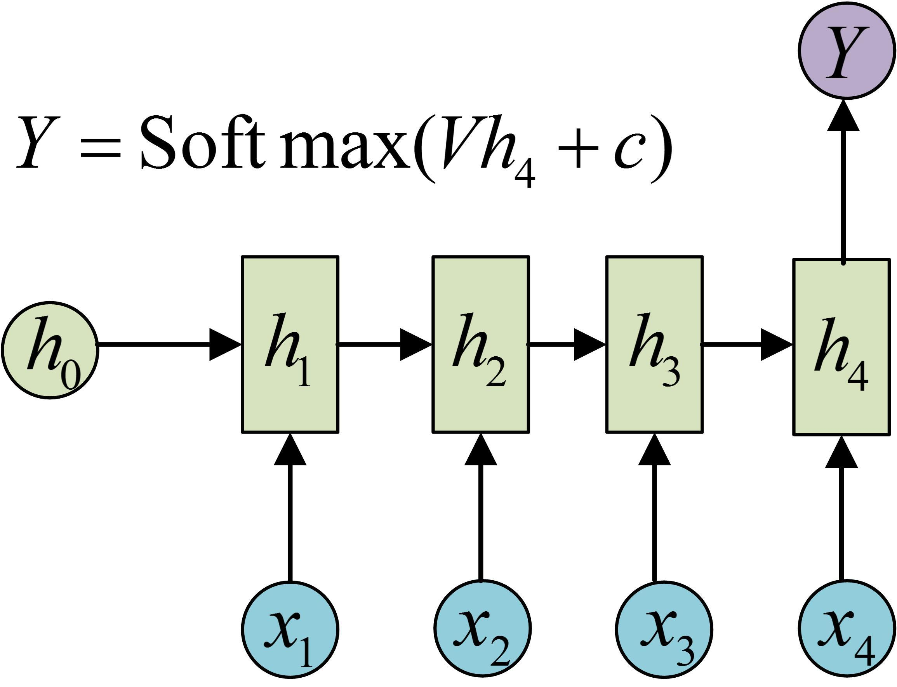

由于该任务是一个分类任务，对于最终的输出，采用将最后一个输出做全连接，输出分类结果。

这是一个手写的RNN模型，输入的维度是[batch_size, n_seq, n_letters=58]，依次处理每个`seq`，将`hidden`和`input`在最后一个特征维度进行拼接，送入`i2h`线性层，在进过`i2o`线性层，分别得到`hidden`向量和一个`output`向量，`hidden`向量会成为下一个`seq`的输入`hidden`，而最后一个`output`向量经过`log_softmax`函数得到最终的输出。

```python
import torch
import torch.nn as nn

class RNN(nn.Module):
    def __init__(self, input_size, hidden_size, output_size):
        super(RNN, self).__init__()

        self.hidden_size = hidden_size

        self.i2h = nn.Linear(input_size + hidden_size, hidden_size)
        self.i2o = nn.Linear(input_size + hidden_size, output_size)

    def forward(self, inputs):
        batch_size, seq_len, input_size = inputs.size()  # [batch_size, n_seq, n_letters]
        inputs = inputs.permute(1, 0, 2)  # 调整输入张量的维度为[seq_len, batch_size, input_size]
        hidden = torch.zeros(batch_size, self.hidden_size, device=inputs.device)
        outputs = []
        for i in range(seq_len):
            input = inputs[i]
            combined = torch.cat((input, hidden), -1)  # [B, input+hidden]
            hidden = self.i2h(combined)
            output = self.i2o(combined)
            output = torch.log_softmax(output, dim=-1)
            # output = self.softmax(output)
            outputs.append(output)
        outputs = torch.stack(outputs, dim=1)  # 将输出张量的维度调整为[batch_size, n_seq, output_size]
        return outputs[:,-1,:]
```

如果使用pytorch自带的RNN模块，只需要增加一个全连接层作为输出即可。并且可以设置RNN的层数来增加网络复杂度，提高训练效果。为了和手写的网络进行区分，还将其设为了**双向**循环神经网络。

```python
import torch
import torch.nn as nn

class BiRNN(nn.Module):
    def __init__(self, input_size, hidden_size, output_size, num_layers=2):
        super(BiRNN, self).__init__()

        self.rnn = nn.RNN(input_size, hidden_size, num_layers=num_layers, batch_first=True, bidirectional=True)
        self.fc = nn.Linear(2*hidden_size, output_size)

    def forward(self, inputs):
        outputs, h_n = self.rnn(inputs)
        outputs = self.fc(outputs[:, -1, :])
        outputs = torch.log_softmax(outputs, dim=-1)
        return outputs
```

### GRU

对于GRU，使用sigmoid和tanh函数对输入和隐含状态进行处理，得到update_gate、reset_gate和new_memory向量，

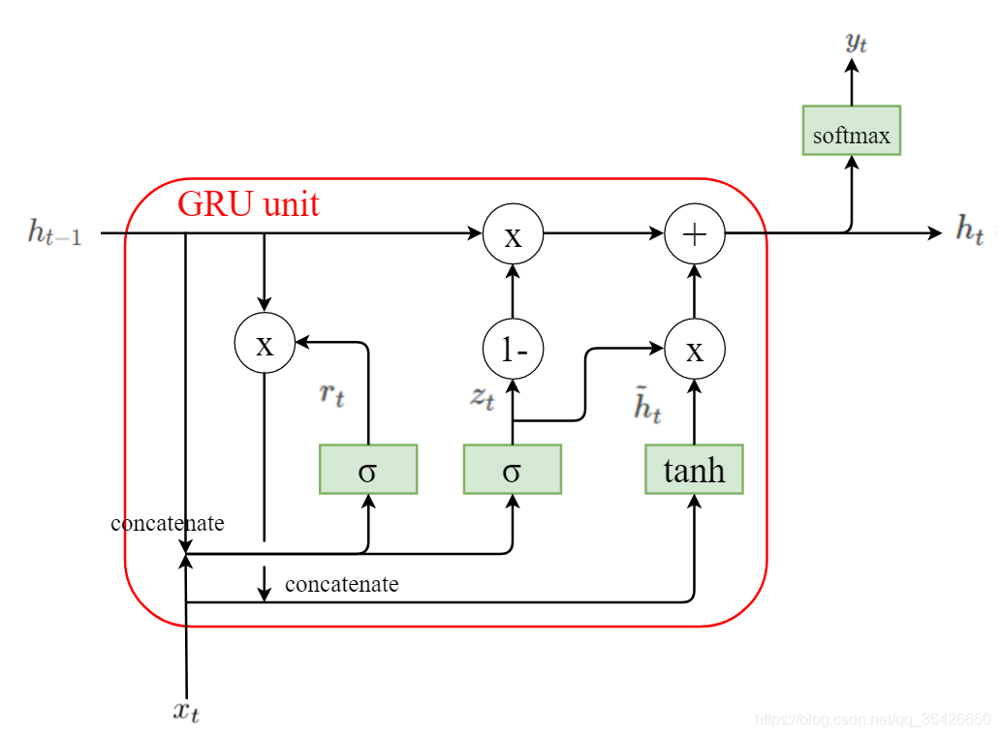

这张图中rt对应reset_gate，zt对应update_gate，而ht_hat对应new_memory。

```python
import torch
import torch.nn as nn

class GRU(nn.Module):
    def __init__(self, input_size, hidden_size, output_size):
        super(GRU, self).__init__()

        self.hidden_size = hidden_size

        self.update_gate = nn.Linear(input_size + hidden_size, hidden_size)
        self.reset_gate = nn.Linear(input_size + hidden_size, hidden_size)
        self.new_memory = nn.Linear(input_size + hidden_size, hidden_size)
        self.output_layer = nn.Linear(hidden_size, output_size)
        self.softmax = nn.LogSoftmax(dim=-1)

    def forward(self, inputs):
        batch_size, seq_len, input_size = inputs.size()  # [batch_size, n_seq, n_letters]
        inputs = inputs.permute(1, 0, 2)  # 调整输入张量的维度为[seq_len, batch_size, input_size]
        hidden = torch.zeros(batch_size, self.hidden_size, device=inputs.device)
        outputs = []
        for i in range(seq_len):
            input = inputs[i]
            combined = torch.cat((input, hidden), -1)
            update_gate = torch.sigmoid(self.update_gate(combined))
            reset_gate = torch.sigmoid(self.reset_gate(combined))
            new_memory = torch.tanh(self.new_memory(torch.cat((input, reset_gate * hidden), -1)))
            hidden = (1-update_gate) * hidden + update_gate * new_memory
            output = self.output_layer(hidden)
            output = self.softmax(output)
            outputs.append(output)
        outputs = torch.stack(outputs, dim=1)  # 将输出张量的维度调整为[batch_size, n_seq, output_size]
        return outputs[:, -1, :]
```

如果使用pytorch自带的GRU模块，只需要增加一个全连接层作为输出即可。同样可以设置GRU的层数和将其变为双向循环神经网络来增加网络复杂度，提高训练效果。

```python
import torch
import torch.nn as nn

class BiGRU(nn.Module):
    def __init__(self, input_size, hidden_size, output_size, num_layers=2):
        super(BiGRU, self).__init__()

        self.gru = nn.GRU(input_size, hidden_size, num_layers=num_layers, batch_first=True, bidirectional=True)
        self.fc = nn.Linear(2*hidden_size, output_size)

    def forward(self, inputs):
        outputs, h_n = self.gru(inputs)
        outputs = self.fc(outputs[:, -1, :])
        outputs = torch.log_softmax(outputs, dim=-1)
        return outputs
```

### LSTM

LSTM的网络结构包含三个门（input gate、forget gate和output gate）和一个记忆单元（memory cell）。

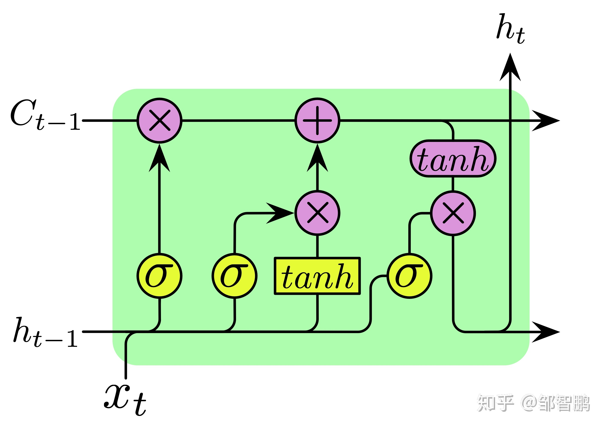

```python
import torch
import torch.nn as nn

class LSTM(nn.Module): 
    def init(self, input_size, hidden_size, output_size): 
        super(LSTM, self).init()

        self.hidden_size = hidden_size

        self.forget_gate = nn.Linear(input_size + hidden_size, hidden_size)
        self.input_gate = nn.Linear(input_size + hidden_size, hidden_size)
        self.cell_gate = nn.Linear(input_size + hidden_size, hidden_size)
        self.output_gate = nn.Linear(input_size + hidden_size, hidden_size)
        self.output_layer = nn.Linear(hidden_size, output_size)
        self.softmax = nn.LogSoftmax(dim=-1)

    def forward(self, inputs):
        batch_size, seq_len, input_size = inputs.size()  # [batch_size, n_seq, n_letters]
        inputs = inputs.permute(1, 0, 2)  # 调整输入张量的维度为[seq_len, batch_size, input_size]
        hidden = torch.zeros(batch_size, self.hidden_size, device=inputs.device)
        cell = torch.zeros(batch_size, self.hidden_size, device=inputs.device)
        outputs = []
        for i in range(seq_len):
            input = inputs[i]
            combined = torch.cat((input, hidden), -1)
            forget_gate = torch.sigmoid(self.forget_gate(combined))
            input_gate = torch.sigmoid(self.input_gate(combined))
            cell_gate = torch.tanh(self.cell_gate(combined))
            cell = forget_gate * cell + input_gate * cell_gate
            output_gate = torch.sigmoid(self.output_gate(combined))
            hidden = output_gate * torch.tanh(cell)
            output = self.output_layer(hidden)
            output = self.softmax(output)
            outputs.append(output)
        outputs = torch.stack(outputs, dim=1)  # 将输出张量的维度调整为[batch_size, n_seq, output_size]
        return outputs[:, -1, :]

```

使用pytorch的LSTM模块来简化代码。

```python
import torch
import torch.nn as nn

class LSTM(nn.Module):
    def __init__(self, input_size, hidden_size, output_size, num_layers=2):
        super(LSTM, self).__init__()

        self.hidden_size = hidden_size

        self.lstm = nn.GRU(input_size, hidden_size, num_layers=num_layers, batch_first=True, bidirectional=True)
        self.fc = nn.Linear(2 * hidden_size, output_size)

    def forward(self, inputs):
        outputs, h_n = self.lstm(inputs)
        outputs = self.fc(outputs[:, -1, :])
        outputs = torch.log_softmax(outputs, dim=-1)
        return outputs
```

## 模型训练

### earlystop和scheduler

训练过程中设置了`earlystop`和`scheduler`。可以更好地优化模型，减少无用的训练。

```python
import transformers

def get_scheduler(optim, num_warmup_steps, num_training_steps):
    # num_warmup_steps是warm up阶段的步数
    # num_training_steps是训练总共需要的步数
    return transformers.get_linear_schedule_with_warmup(optim, num_warmup_steps, num_training_steps)
```

```python
import numpy as np
import torch
from pathlib import Path


class EarlyStopping:
    """Early stops the training if validation loss doesn't improve after a given patience."""

    def __init__(self, patience=7, verbose=False, delta=0, model_name='default model'):
        """
        Args:
            patience (int): How long to wait after last time validation loss improved.
                            上次验证集损失值改善后等待几个epoch
                            Default: 7
            verbose (bool): If True, prints a message for each validation loss improvement.
                            如果是True，为每个验证集损失值改善打印一条信息
                            Default: False
            delta (float): Minimum change in the monitored quantity to qualify as an improvement.
                            监测数量的最小变化，以符合改进的要求
                            Default: 0
        """
        self.patience = patience
        self.verbose = verbose
        self.counter = 0
        self.best_score = None
        self.early_stop = False
        self.val_loss_min = np.Inf
        self.delta = delta
        root_dir = Path('models_weight')
        root_dir.mkdir(exist_ok=True)
        self.save_path = root_dir / (model_name + '.pkl')

    def __call__(self, val_loss, model):

        score = -val_loss

        if self.best_score is None:
            self.best_score = score
            self.save_checkpoint(val_loss, model)
        elif score < self.best_score + self.delta:
            self.counter += 1
            print(f'EarlyStopping counter: {self.counter} out of {self.patience}')
            if self.counter >= self.patience:
                self.early_stop = True
        else:
            self.best_score = score
            self.save_checkpoint(val_loss, model)
            self.counter = 0

    def save_checkpoint(self, val_loss, model):
        '''
        Saves model when validation loss decrease.
        验证损失减少时保存模型。
        '''

        if self.verbose:
            print(f'Validation loss decreased ({self.val_loss_min:.6f} --> {val_loss:.6f}).  Saving model ...')
        # torch.save(model.state_dict(), 'checkpoint.pt')     # 这里会存储迄今最优模型的参数
        torch.save(model, self.save_path)  # 这里会存储迄今最优的模型
        self.val_loss_min = val_loss
```

### 训练和验证

一轮训练的过程如下：

```python
# import tensorflow as tf
from tqdm import tqdm
import torch
from tensorboardX import SummaryWriter


def train(trainloader, net, criterion, optimizer, epoch, device, train_summary_writer, scheduler):
    net.train()
    with tqdm(trainloader, desc=f'Train epoch {epoch}') as tbar:
        for i, data in enumerate(trainloader):
            inputs, labels = data
            # batch_size, seq_len, input_size = inputs.size()
            nputs, labels = inputs.to(device), labels.to(device)
            # n_categories = trainloader.dataset.n_categories
            optimizer.zero_grad()
            # h0 = torch.randn(1, batch_size, n_categories)
            outputs = net(inputs)
            loss = criterion(outputs, labels)
            loss.backward()
            optimizer.step()
            scheduler.step()  # 调节学习率
            # accuracy
            accuracy = (labels == torch.argmax(outputs, dim=1)).float().sum() / labels.shape[0]
            # 在tqdm中展示loss
            tbar.set_postfix(running_loss=loss.item(), acc=f'{100 * accuracy.item():.2f}%')
            # 更新进度条
            tbar.update()

            # with train_summary_writer.as_default():
            #     tf.summary.scalar('loss', loss.item(), step=epoch * len(trainloader) + i)
            train_summary_writer.add_scalar('loss', loss.item(), epoch * len(trainloader) + i)
            train_summary_writer.add_scalar('acc', accuracy.item(), epoch * len(trainloader) + i)
```

一轮验证的过程如下：

```python
# import tensorflow as tf
from tqdm import tqdm
import torch


def evaluate(testloader, net, epoch, device, test_summary_writer):
    with tqdm(testloader, desc=f'Evaluate epoch {epoch}') as tbar:
        # 在测试集上测试准确率
        net.eval()
        correct = 0
        total = 0
        with torch.no_grad():
            for i, data in enumerate(testloader):
                inputs, labels = data
                inputs, labels = inputs.to(device), labels.to(device)
                outputs = net(inputs)
                _, predicted = torch.max(outputs, 1)
                total += labels.size(0)
                correct += (predicted == labels).sum().item()
                # 在tqdm中展示loss

                tbar.set_postfix(eval_acc=f'{100 * correct / total:.2f}%')
                # 更新进度条
                tbar.update()
        acc = 100 * correct / total
        test_summary_writer.add_scalar('accuracy', acc, epoch)

    return acc
```

## 结果分析

模型训练结果的绘制程序如下：

先将tensorboard上的结果上传到tensorboard.dev，在读取数据，绘制loss和acc的折线图（下面的链接都是可访问的）。

```python
from utils import plot_loss_acc
# 绘制loss和acc曲线
# https://tensorboard.dev/experiment/hYKWk0d6QvaGmzIElxkLJg
model_ls = ['bigru', 'birnn', 'lstm']
experiment_id = "hYKWk0d6QvaGmzIElxkLJg"
group_by = 'bs'
for model in model_ls:
    plot_loss_acc(experiment_id, model, group_by, "compare_batchsize.csv", f"compare_{model}_batchsize.png")

# https://tensorboard.dev/experiment/SWriGlcYRpO3APpWRDDsQA/
model_ls = ['bigru', 'birnn', 'lstm']
experiment_id = "SWriGlcYRpO3APpWRDDsQA"
group_by = "layer_nums"
for model in model_ls:
    plot_loss_acc(experiment_id, model, group_by, "compare_layer_nums.csv", f"compare_{model}_layer_nums.png")

# https://tensorboard.dev/experiment/9HKd2pD2S6ewhbrBgcoGcQ/
model_ls = ['bigru', 'birnn', 'lstm']
experiment_id = "9HKd2pD2S6ewhbrBgcoGcQ"
group_by = "optim"
for model in model_ls:
    plot_loss_acc(experiment_id, model, group_by, "compare_optim.csv", f"compare_{model}_optim.png")

# https://tensorboard.dev/experiment/vYLbQHqzR6qzWhYeCNWIjQ
model_ls = ['bigru', 'birnn', 'lstm']
experiment_id = "vYLbQHqzR6qzWhYeCNWIjQ"
group_by = "optim"
for model in model_ls:
    plot_loss_acc(experiment_id, model, group_by, "compare_optim_bs8_lr0.075.csv",
                  f"compare_{model}_optim_bs8_lr0.075.png")

# https://tensorboard.dev/experiment/gz8hL2OUQ26hRR1FbtVXCg
model_ls = ['gru', 'bigru', 'rnn', 'birnn', 'lstm', 'bilstm']
experiment_id = "gz8hL2OUQ26hRR1FbtVXCg"
group_by = 'model'
plot_loss_acc(experiment_id, 'compare different models', group_by, "compare_model.csv", "compare_model.png")

# https://tensorboard.dev/experiment/ck7LNaMBT2m0z233pZzSmg/
model_ls = ['bigru', 'birnn', 'bilstm']
experiment_id = "ck7LNaMBT2m0z233pZzSmg"
group_by = "lr"
for model in model_ls:
    plot_loss_acc(experiment_id, model, group_by, "compare_lr.csv",
                  f"compare_{model}_lr.png")
```

### 比较不同模型

超参数设置如下：

`batch_size = 8, learning_rate = 0.075, num_epochs = 30`

模型效果依次是`BiLSTM>BiGRU>GRU>BiRNN>LSTM>RNN`。

BiLSTM/BiGRU/LSTM/GRU：这些模型能够在处理字符时同时考虑之前和之后的信息，因此具有较好的效果。此外，这些模型能够通过门控机制有效地捕捉长序列中的信息，避免了梯度消失和梯度爆炸等问题，因此在处理长序列数据时也具有较好的效果。

BiRNN：缺少门控单元，但因为也考虑了双向的信息，效果相对RNN有提升。

RNN：结构简单，在处理长序列数据时容易出现梯度消失和梯度爆炸等问题，因此效果较差。

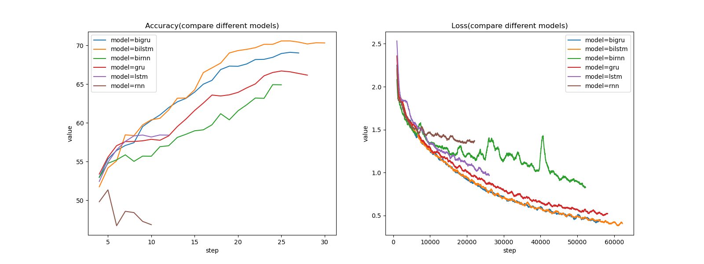

### 比较不同优化器

对于bigru模型，Adadelta优化器的效果最好，但是各个优化器的区别都不是很大，且都持续在进行有效训练，没有被早停所截断。

`bs = 8, lr = 0.05`
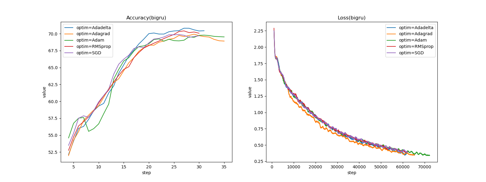

`bs = 8, lr = 0.075`

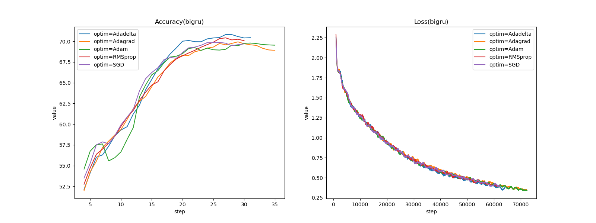


对于birnn模型，Adam优化器效果最好，且RMSprop和Adagrad出现了早停，模型收敛效果也比较差。

`bs = 8, lr = 0.05`

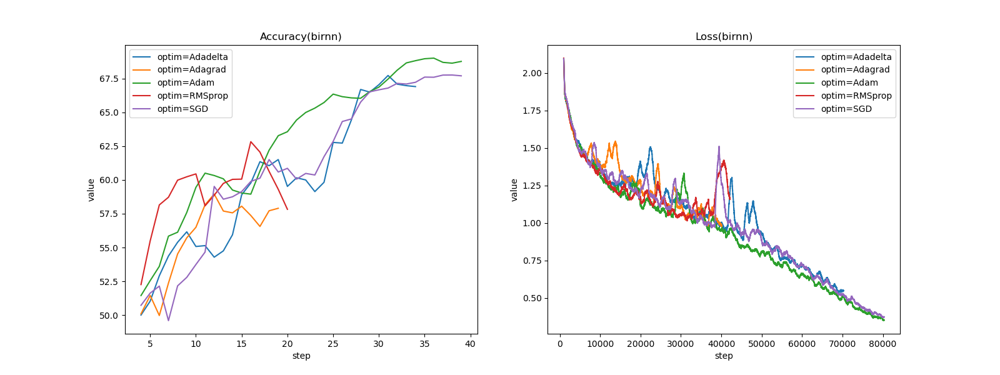

`bs = 8, lr = 0.075`


对于lstm模型，Adagrad(lr=0.05)/Adadelta(lr=0.075)优化器的效果最好，但是各个优化器的区别都不是很大，且都持续在进行有效训练，没有被早停所截断。

`bs = 8, lr = 0.05`

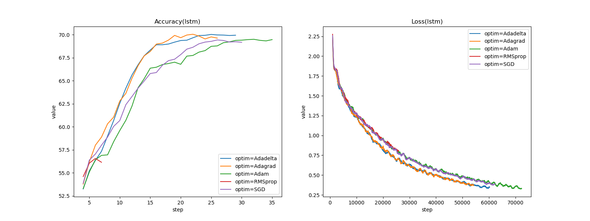

`bs = 8, lr = 0.075`

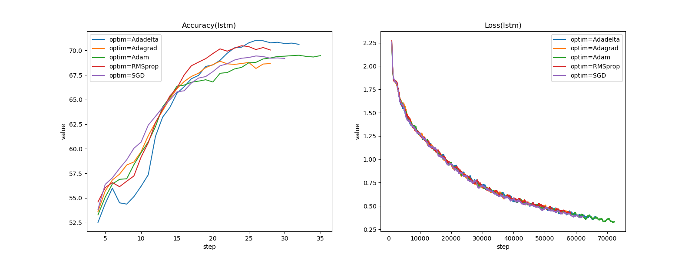

不同的优化器在不同模型上的效果不同，收敛速度和效果也大相径庭。因此不同的模型应当选择不同优化器进行训练。改变学习率也一定程度上影响了优化器对模型的效果。

### 比较不同batchsize

随着batch_size增大，模型的训练时间会减少，但每个批次的更新也会变得更加嘈杂。这可能会导致模型在训练数据上的表现变差，因为模型更难学习到数据的细节特征。

此外，对于小数据集来说，使用大批量大小会导致模型过度拟合训练数据，因为模型在每个批次中都会看到所有的数据，这样可能会导致模型学习到噪声而不是真正的模式。因此，通常建议在小数据集上使用小批量大小，以避免过度拟合并提高模型的泛化能力。

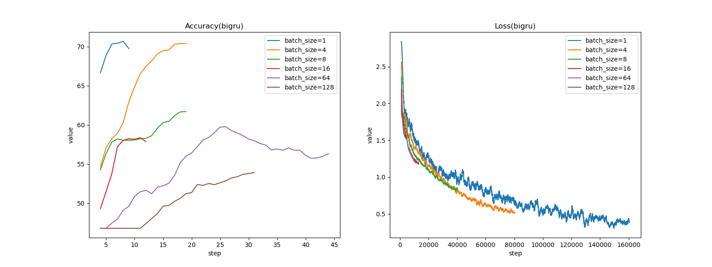

在RNN模型中，发现loss不降反升，模型出现了退化，出现梯度爆炸，而GRU和LSTM都没有这个现象。

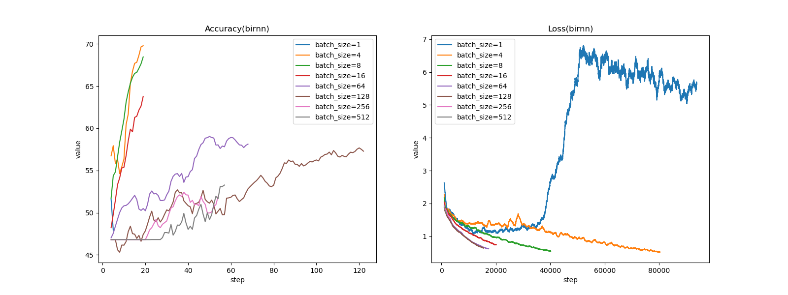

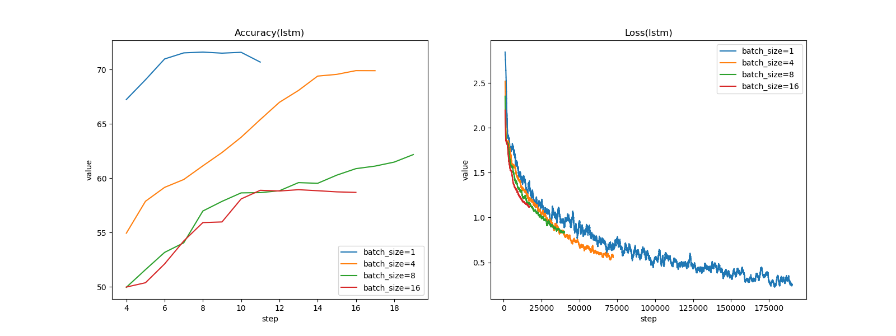

### 比较模型层数

越深的模型一般效果越好，且收敛速度会更快。

`batch_size=8, learning_rate=0.1, model=bigru`

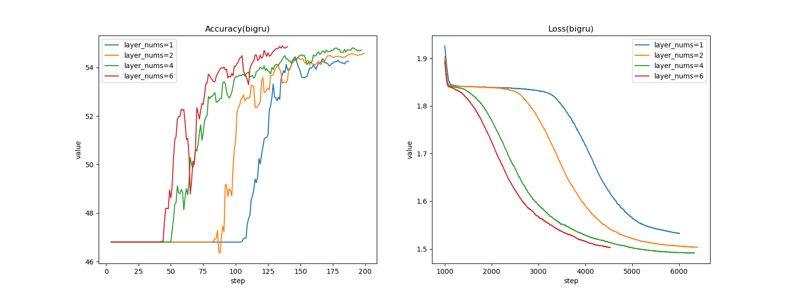

`batch_size=8, learning_rate=0.1, model=birnn`

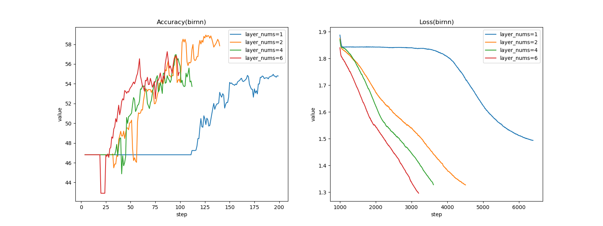

`batch_size=128, learning_rate=0.05, model=lstm`

层数增加到6时效果开始下降。

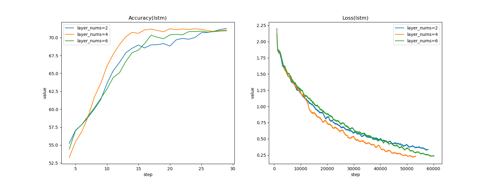

### 比较学习率

BiLSTM模型超参数设置：`batch_size=8`，learning rate为0.1时出现梯度爆炸。learning rate为0.005/0.05/0.075时差异不大。

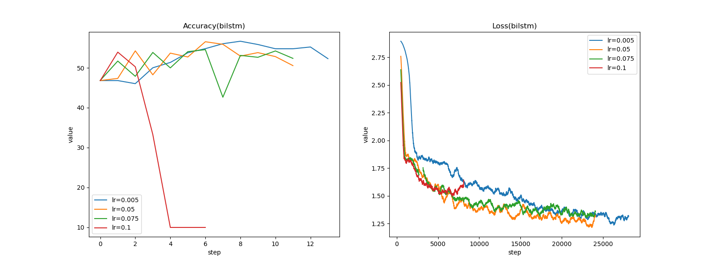

BiRNN模型超参数设置：`batch_size=128`，learning rate过大或过小都会导致模型不能正常学习，0.01/0.05/0.075是较为正常。

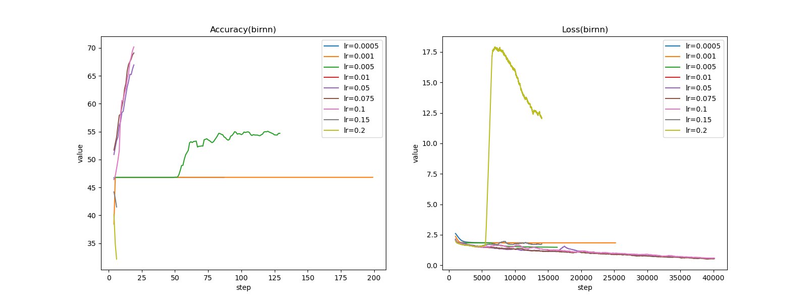

BiGRU模型超参数设置：`batch_size=128`，学习率为0.001/0.005时出现了模型退化，而0.01/0.05的学习率则较为正常。

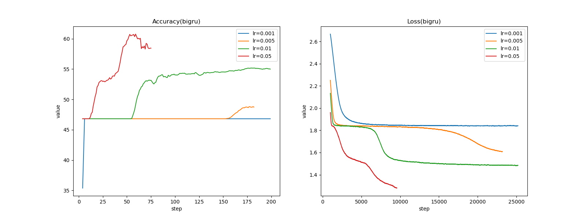

## 超参数设置的心得和结论

### 👑小batch_size取得了异常好的结果

从数据集特征的角度，该数据集较小，训练集和测试集按照8:2分割后，训练集只有16053条，对于一个18分类的任务而言，平均一个类别只有不到1000条数据。因此在实验中会发现，尽管batch_size的增大提高了模型训练的速度，但是却显著影响了模型收敛速度，尽管不断降低学习率，也无法达到小batch_size的水平。

例如，这是一个使用BiRNN模型，batch_size分别是128和8，学习率分别0.05和0.1的两个训练示例，会发现batch_size为8的模型（下面称为bs8）收敛速度远高于batch_size为128的模型（下面称为bs128）。bs128经过120多轮训练，也仅仅取得了56%的准确率，而bs8仅有不到20轮训练，就取得了近65%的准确率，并且还没有明显的模型退化现象。

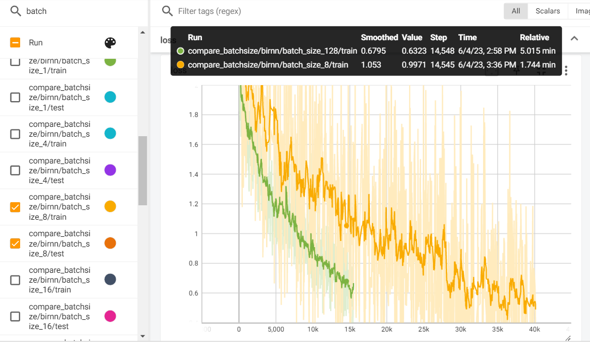

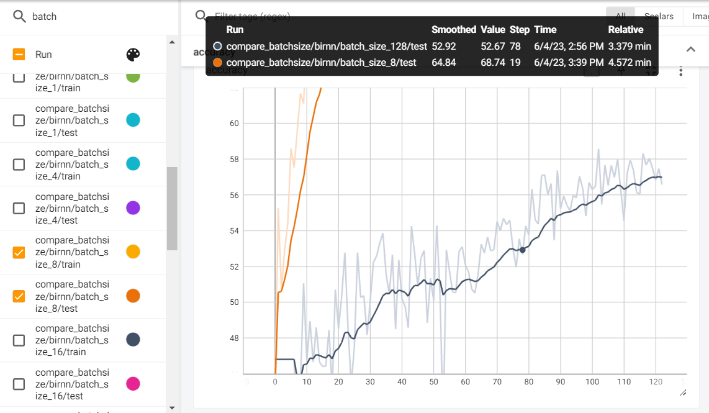

### 👑不好的学习率直接导致了模型不收敛

这次实验观察到很多次模型不收敛的现象，除了batch_size设置过大之外，还有一个重要原因就是学习率不合适。以batch_size=8的BiGRU模型为例，学习率分别设置为[0.05, 0.075, 0.1, 0.15, 0.2]，0.2和0.1的收敛情况都十分糟糕，直接导致准确率随训练轮数下降。

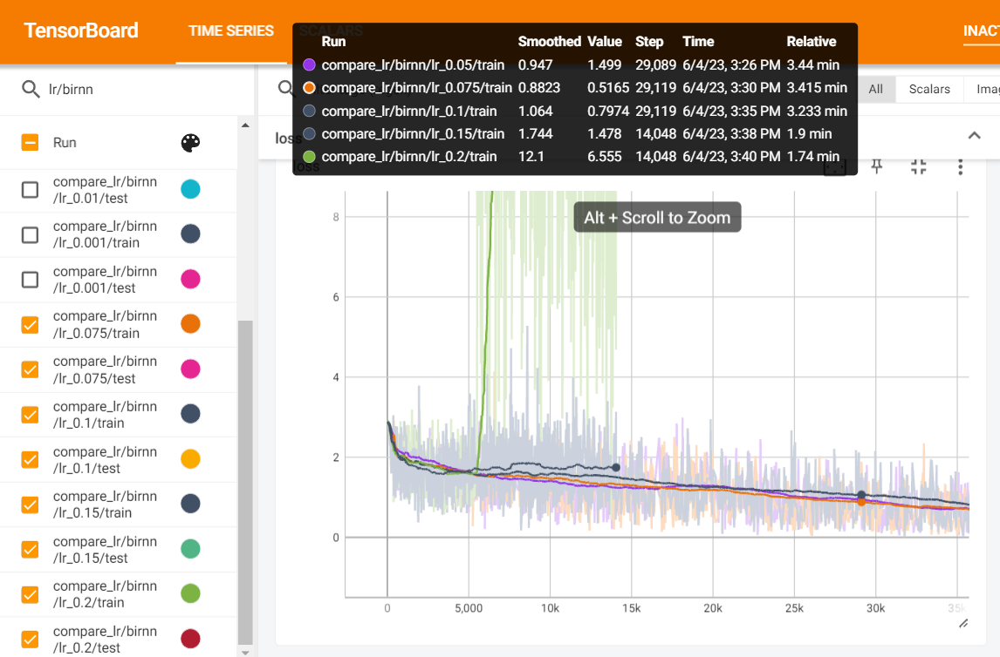

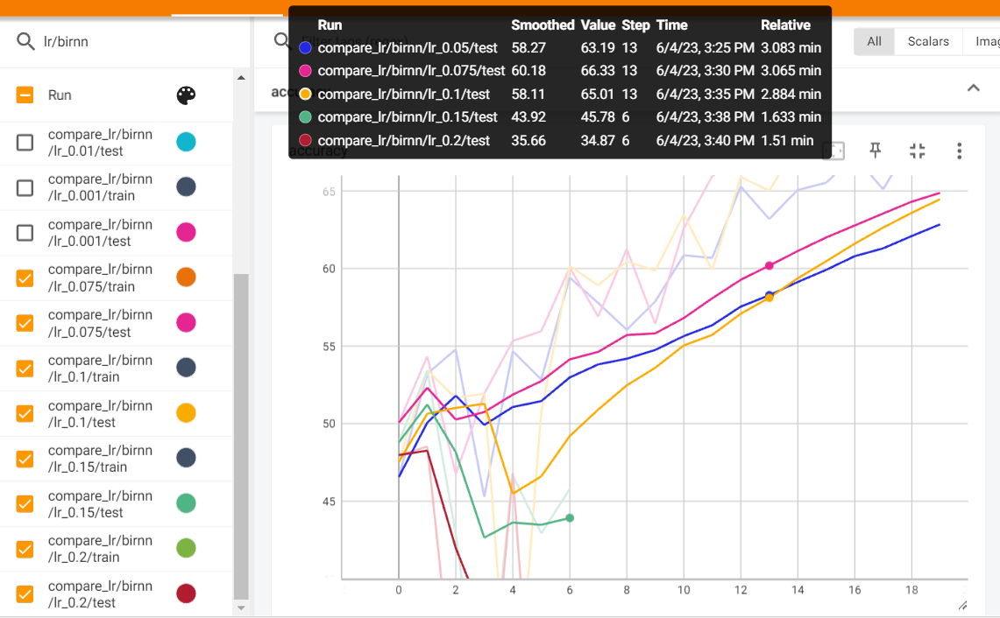

### 👑模型深度提升模型效果

随着循环神经网络的层数加深，在三类模型上都能观察到效果的提升。不过因为模型、batch_size的不同，效果的明显程度也有不同。

以LSTM和GRU和为例，batch_size分别为8和128，学习率分别为0.05和0.1。

对GRU来说，层数越深，效果越好。

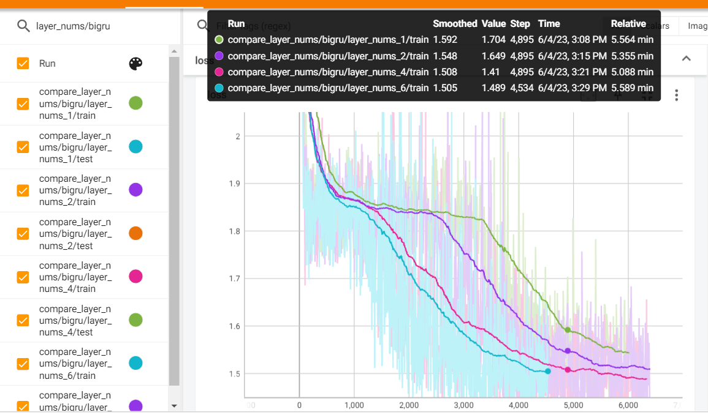

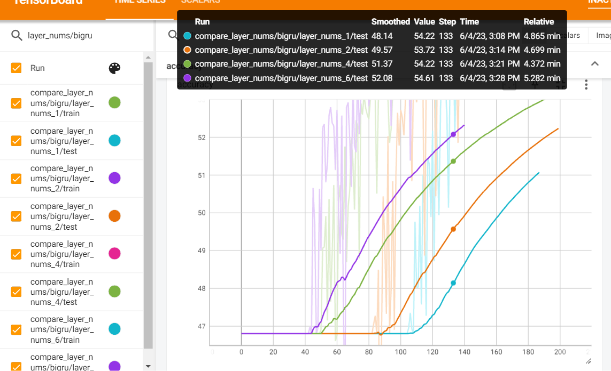

对LSTM来说，layer为4时，效果最好，且差异不显著。

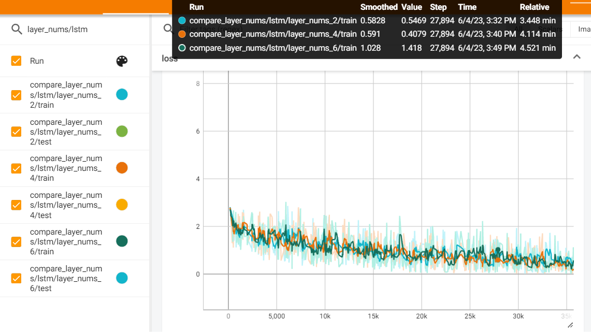

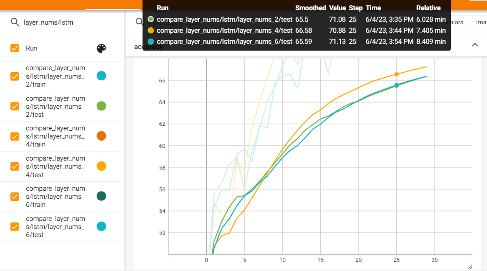
